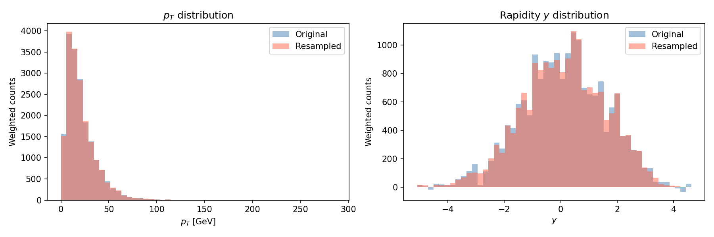

# Cell Resampling Demonstration

This project implements a **cell resampling** algorithm that eliminates negative event
weights from Monte Carlo particle-physics samples while conserving the total weight and
preserving the phase-space distributions.

---

## Algorithm Structure

The input is a set of events, each described by transverse momentum `pt`, rapidity `y`,
and a signed weight `w`.  The goal is to produce an equivalent set where every weight is
non-negative.

### Steps

1. **KDTree construction** (`build_kdtree`)  
   All events are projected into a 2-D feature space `(pt, 10·y)`.  A KDTree is built
   over these scaled coordinates to allow fast nearest-neighbour queries.

2. **Seed selection** (`cell_resampling` main loop)  
   Events are scanned sequentially. Any event with a non-negative weight,
or already assigned to a previous cell, is skipped. Each remaining
negative-weight event acts as the seed of a new cell.

3. **Cell growing** (`grow_cell`)  
   Starting from the seed, the nearest unused neighbours are added one by one (in order of
   distance) until the running sum of weights inside the cell becomes ≥ 0.  To avoid
   querying all N neighbours upfront, the neighbour list is expanded with **incremental
   k-doubling**: the KDTree is first queried for k = 10 neighbours; if the cell has not
   converged, k is doubled and the query is re-issued, continuing until the cell converges
   or all events are exhausted.

4. **Weight redistribution** (`redistribute_weights`)  
   Within the finished cell the weights are replaced by:

   $$w'_i = \frac{|w_i|}{\sum_j |w_j|} \cdot \sum_j w_j$$

   This makes every weight in the cell positive while keeping their sum (and therefore the
   total cross-section contribution) exactly conserved.

5. **Repeat** until every negative-weight seed has been processed.

### Computational Complexity

| Step | Cost | Notes |
|---|---|---|
| KDTree build | O(N log N) | standard KDTree construction |
| Main loop (iterations) | O(N) | at most N seeds |
| KDTree query per seed — amortised | O(k log N) | k = cell size; k-doubling means at most O(log N) re-queries per seed |
| Weight redistribution per cell | O(k) | single pass over cell members |
| **Overall** | O(N log N) (typical) | dominated by KDTree queries |

Worst-case complexity is **O(N²)**, since a negative-weight seed may require scanning a
large fraction of the dataset to accumulate enough positive weight to close the cell.
However, in realistic event samples the average cell size *k* is small (typically only a
few neighbours are needed), so the algorithm behaves much closer to **O(N log N)** in
practice, with the KDTree construction and queries dominating the runtime.

---

## Discussion: Why is the Scaling Factor Necessary?

### The problem with raw Euclidean distance

The two phase-space coordinates, `pt` (transverse momentum) and `y` (rapidity), live on
very different numerical scales.  In typical particle physics samples `pt` spans a range
of tens to hundreds of GeV, while rapidity `y` is dimensionless and confined to a range
of order ±5 or so.  Raw Euclidean distance

$$d = \sqrt{(\Delta p_t)^2 + (\Delta y)^2}$$

would therefore be completely dominated by the `pt` axis.  Two events that are far apart
in rapidity but close in `pt` would be treated as near-neighbours, while two events that
are close in rapidity but differ by even a modest amount of `pt` would appear distant.
The "cells" grown by the algorithm would be elongated slabs in rapidity rather than
compact, physically meaningful clusters, grouping events that are not actually nearby in
phase space.

### What the factor of 100 (i.e. scaling y by 10) achieves

Multiplying `y` by 10 — which makes its contribution to squared distance `(10 Δy)² = 100
(Δy)²` — rescales the rapidity axis so that one unit of rapidity difference counts as
much as ten GeV of `pt` difference.  This brings the two axes onto a comparable footing
and ensures the nearest-neighbour search groups events that are genuinely close in
both `pt` and `y`, producing physically compact cells.  The precise value (100, or any
other factor) should be chosen to reflect the relative physical importance of the two
coordinates in the sample of interest; it is a tunable hyperparameter.

### Effect in the limit of infinitely many generated events

As the number of generated events increases, the local event density in
phase space grows. Cells therefore need to include only very small
neighbourhoods around the seed in order to reach a non-negative total
weight. In the infinite-statistics limit the cell size tends toward
zero, so the resampling procedure approaches an exact local
redistribution and the physical distributions are preserved.

Without a proper scaling factor the asymmetric metric causes cells to grow preferentially
along the rapidity axis even as $N$ grows, so the `pt` distribution is well reproduced
but the rapidity distribution is smeared.  With the correct scaling, cells shrink
isotropically in the scaled space, and the resampled distributions converge to the true
physical distributions in both `pt` and `y` simultaneously.  This means the choice of
scaling factor directly controls which physical distribution is faithfully recovered in
the infinite-statistics limit: a poorly chosen factor will leave a residual bias in one
coordinate no matter how many events are generated.

## Properties of the Resampling

The resampling procedure preserves two important physical properties:

1. **Total weight conservation**
   The sum of weights in each cell, and therefore the total event weight
   in the dataset, remains unchanged.

2. **Local phase-space structure**
   Since weight redistribution occurs only among nearby events in
   **(pt, y)** space, the observable distributions are preserved within
   detector resolution.

## Results

After applying cell resampling, all negative weights are eliminated while
preserving the original physical distributions.

